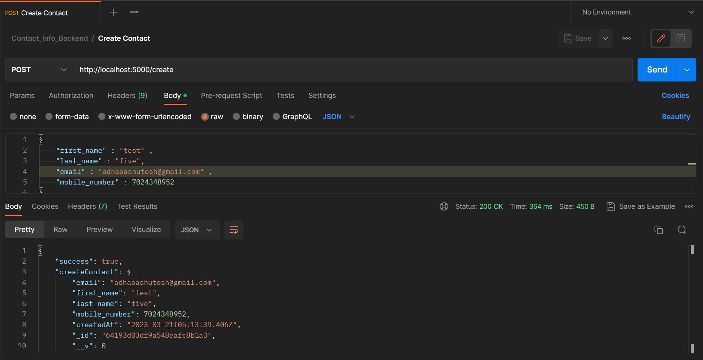
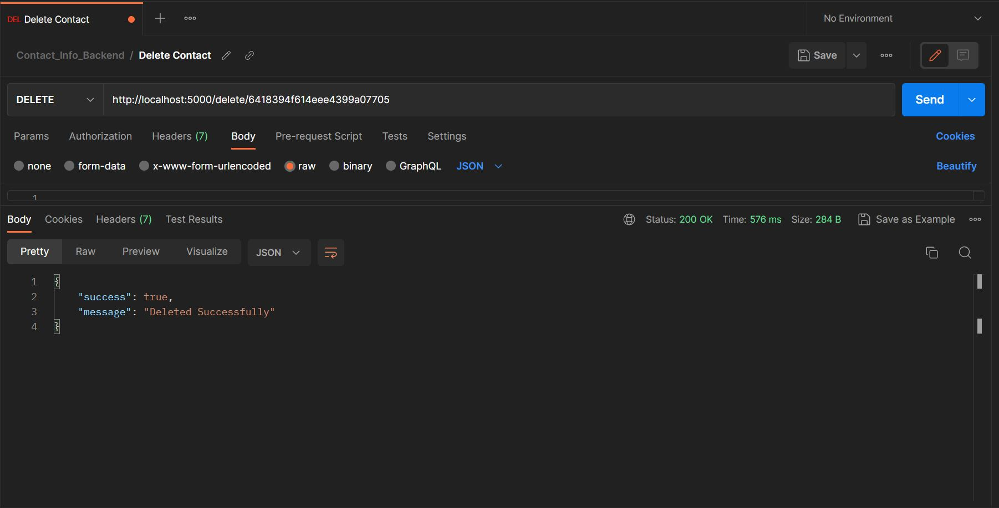
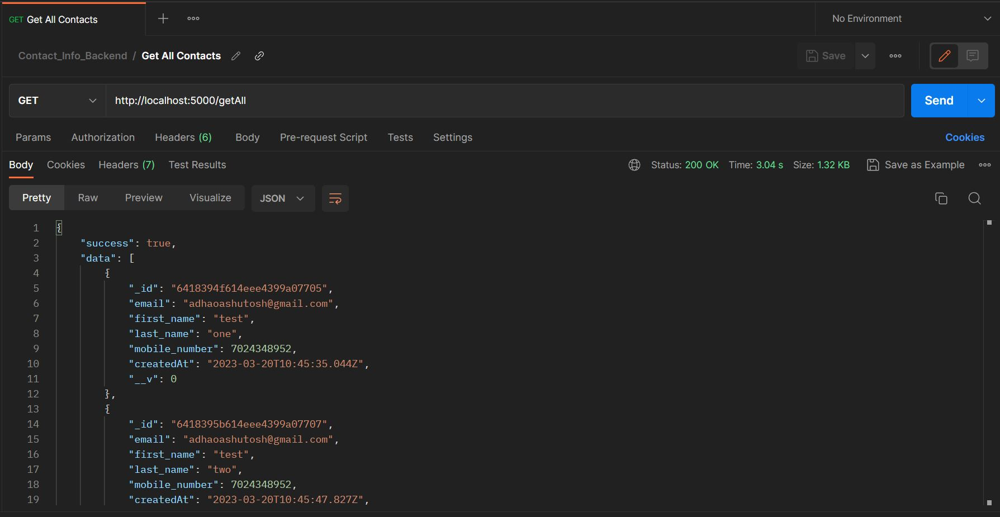
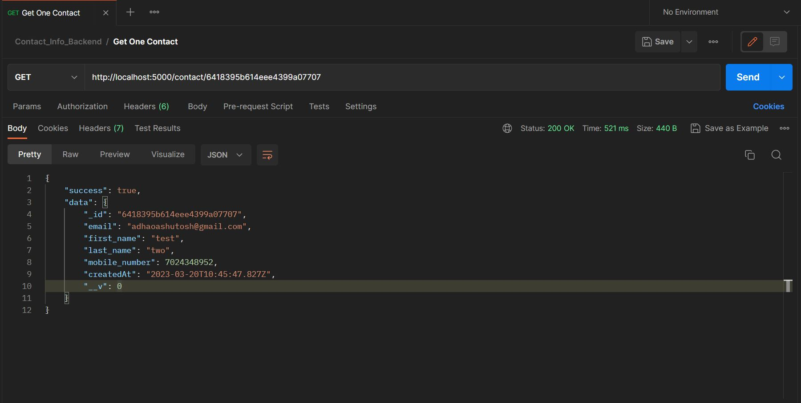
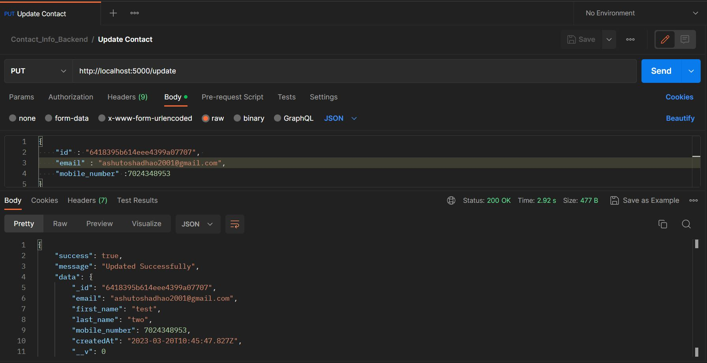

# Contact Information Backend ( CURD Oparations )

This Project is made using node js as server , mongodb as Database

**See ScreenShots At Last**

## Features

- Create Contact
- Delete Contact
- Update Contact
- Get One / Single Contact
- Get All Contacts

## Installation

Install my-project with

```bash
  npm i
```

## Environment Variables

To run this project, you will need to add the following environment variables to your .env file

`DB_URL`

fill each filed with your info respectively

## Author

Hello Guys, my name is Ashutosh Adhao, i am currently in final year you can connect me by. . .

- [LinkedIn](https://www.linkedin.com/in/ashutoshadhao/)
- [Instagram](https://www.instagram.com/ashutoshadhao/)

## Screenshots
### Create

### Delete 

### Get All Contact 

### Get One Contact 

### Update 

